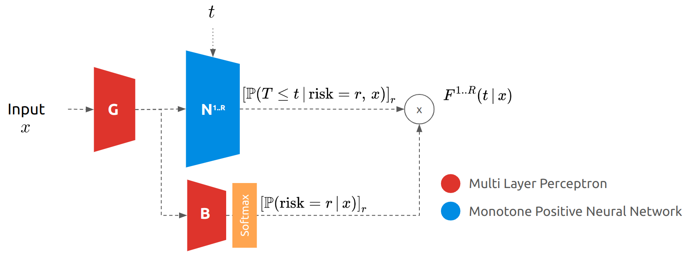

# Neural Fine Gray
This repository allows to reproduce the results in [Neural Fine Gray]()
A neural network approach to the problem of competing risks, leveraging monotone neural networks to model the cumulative incidence function.

## Model
The model consists in two neural networks: one models the cumulative incidence function and the other the balance to ensure that they add up to one.



## How to use ?
To use the model, one needs to execute:
```python
from nfg import NeuralFineGray
model = NeuralFineGray()
model.fit(x, t, e)
model.predict_risk(x, risk = 1)
```
With `x`, the covariates, `t`, the event times and `e`, the cause of end of follow up (0 is censoring).

A full example with analysis is provided in `examples/Neural Fine Gray on FRAMINGHAM Dataset.ipynb`.
## Reproduce paper's results
To reproduce the paper's results:

0. Clone the repository with dependencies: `git clone git@github.com:Jeanselme/NeuralFineGray.git --recursive`
1. Create a conda environment with all necessary libraries `pycox`, `lifelines`, `pysurvival`
2. Add path `export PYTHONPATH="$PWD:$PWD/DeepSurvivalMachines:$PYTHONPATH"`
3. Run `examples/experiment_competing_risk.py FRAMINGHAM`
4. Repeat with `PBC`, `SYNTHETIC_COMPETING` and `SEER`
5. Analysis using `examples/Analysis.ipynb`

## Compare to a new method
Adding a new method consists in adding a child to `Experiment` in `experiment.py` with functions to compute the nll and fit the model.
Then, add the method in `examples/experiment_competing_risk.py` and follow the previous point. 
`TODOs` have been added to make the addition of a new method easier.

# Setup
## Structure
We followed the same architecture than the [DeepSurvivalMachines](https://github.com/autonlab/DeepSurvivalMachines) repository with the model in `nfg/` - only the api should be used to test the model. Examples are provided in `examples/`. 

## Clone
```
git clone git@github.com:Jeanselme/NeuralFineGray.git --recursive
```

## Requirements
The model relies on `DeepSurvivalMachines`, `pytorch`, `numpy` and `tqdm`.  
To run the set of experiments `pycox`, `lifelines`, `pysurvival` are necessary.